<!-- ░░░ LOGO OFICIAL OBSIDIAN-SEC (sobre tarjeta, visible en claro y oscuro) ░░░ -->

<!-- ░░░ ANIMACIÓN DE ESCRITURA ░░░ -->
  

 

 

  

## Sobre mí

Soy **Yad Carias**, fundador y CEO de **[Obsidian-Sec](https://obsidian-sec.com)**. Dirijo
operaciones de red team y seguridad ofensiva para organizaciones que necesitan saber, con
evidencia y no con suposiciones, hasta dónde puede llegar un atacante real contra ellas.

Mi trabajo combina dirección y técnica. Defino la estrategia de la empresa y, al mismo tiempo,
desarrollamos software a medida, herramientas y automatizaciones que sostienen nuestras
operaciones, del código de bajo nivel en C y Rust hasta los paneles donde cada cliente sigue
sus hallazgos en tiempo real. Usamos y creamos **inteligencia artificial** en nuestros productos
y procesos, trabajamos con **metodologías ágiles** y extendemos la seguridad también al terreno
del **IoT**.

**En lo que me enfoco hoy:**
- Consolidar a Obsidian-Sec como un socio de seguridad de referencia.
- Desarrollo de software a medida y automatizaciones para nuestras operaciones y las de clientes.
- Construir productos de IA propios para reforzar y acelerar el trabajo del equipo.
- Investigación en exploit dev, seguridad de IoT y seguridad en la nube.

Para colaboraciones, consultoría o divulgación responsable: **yahmed@obsidian-sec.com**.

## Tecnologías

| Área | Stack |
|:--|:--|
| **Lenguajes** |       |
| **Desarrollo y producto** |       |
| **Seguridad ofensiva** |      |
| **Inteligencia artificial** |      |
| **IoT** |     |
| **Automatización** |      |
| **Metodología ágil** |    |
| **Nube e infraestructura** |      |

## Actividad en GitHub

 

  

<!-- ░░░ SERPIENTE — se activa al ejecutar el workflow snake.yml ░░░ -->
<picture>
  <source media="(prefers-color-scheme: dark)" srcset="https://raw.githubusercontent.com/x099/x099/output/github-contribution-grid-snake-dark.svg"/>
  
</picture>

  

